# Python Summer School 2024

## Substructure search

Substructure search of chemical compounds is a crucial tool in cheminformatics, enabling researchers to identify and analyze chemical structures containing specific substructures. This method is widely applied in various fields of chemistry, including drug discovery, materials science, and environmental research. Substructure search helps scientists and engineers identify compounds with desired properties, predict reactivity, and understand the mechanisms of chemical reactions.

Modern chemical compound databases contain millions of entries, making traditional search methods inefficient and time-consuming. Substructure search utilizes algorithms that allow for quick and accurate identification of compounds with specified structural fragments. These algorithms are based on graph theory and the use of SMARTS (SMiles ARbitrary Target Specification) codes, ensuring high performance and precision in the search process.

## SMILES

A key element in the representation of chemical structures is the Simplified Molecular Input Line Entry System (SMILES). SMILES is a notation that allows a user to represent a chemical structure in a way that can be easily processed by computers. It encodes molecular structures as a series of text strings, which can then be used for various computational analyses, including substructure searches. The simplicity and efficiency of SMILES make it a widely adopted standard in cheminformatics.

Here are some examples of SMILES notation:

- Water (H₂O): O

- Methane (CH₄): C

- Ethanol (C₂H₅OH): CCO

- Benzene (C₆H₆): c1ccccc1

- Acetic acid (CH₃COOH): CC(=O)O

- Aspirin (C₉H₈O₄): CC(=O)Oc1ccccc1C(=O)O

## Examples of Substructure Search

Below are some examples of substructure searches with visual representations:

1. Searching for the Benzene Ring:
   - Substructure (Benzene): c1ccccc1
   
   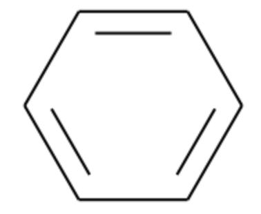
   
   - Example of Found Compound (Toluene): Cc1ccccc1
   
   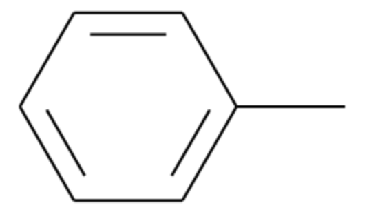
   
2. Searching for a Carboxylic Acid Group:
   - Substructure (Carboxylic Acid): C(=O)O
   
   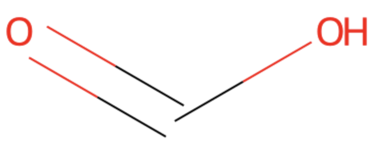
   
   - Example of Found Compound (Acetic Acid): CC(=O)O
   
   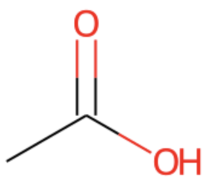

These examples illustrate how substructure searches can be used to find compounds containing specific functional groups or structural motifs. By using SMILES notation and cheminformatics tools, researchers can efficiently identify and study compounds of interest.

## Homework

As part of our homeworks, we will try to build a web service for storing and substructural search of chemical compounds

- Use the **RDKit** library to implement substructure search

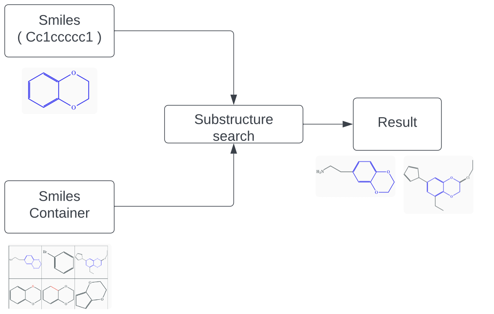

- Build RESTful API using **FastApi**

- Containerizing our solution using **Docker**

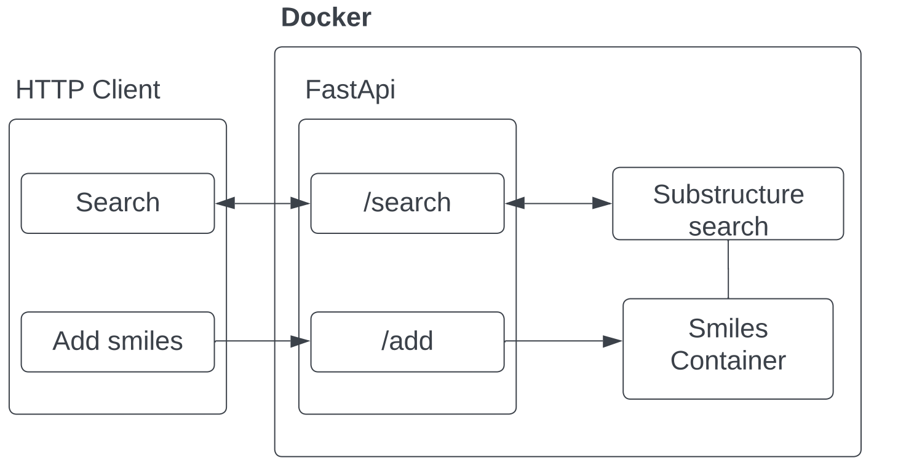

- Adding tests using **pytest**

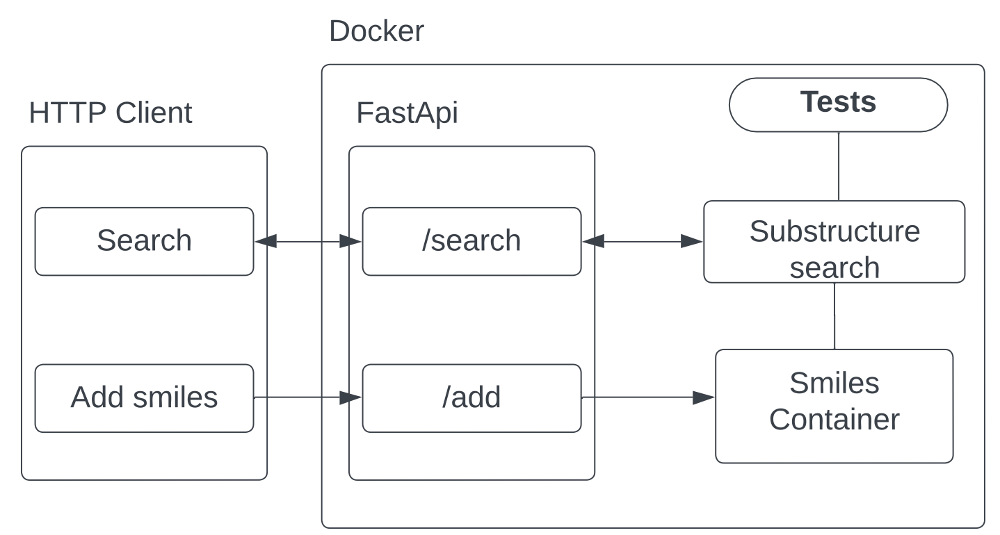

- **CI / CD**

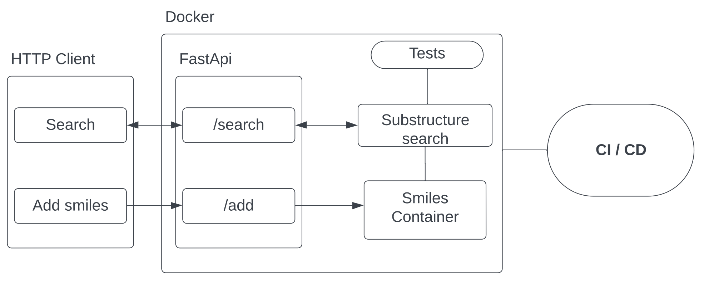

- We will add a **database** for storing molecules

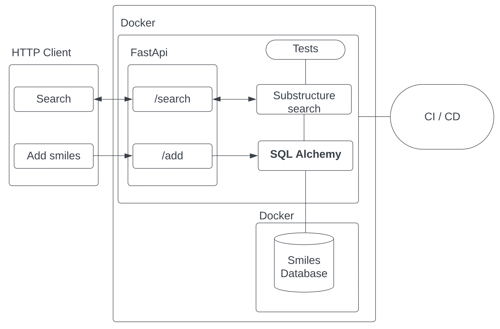

- **Logging**

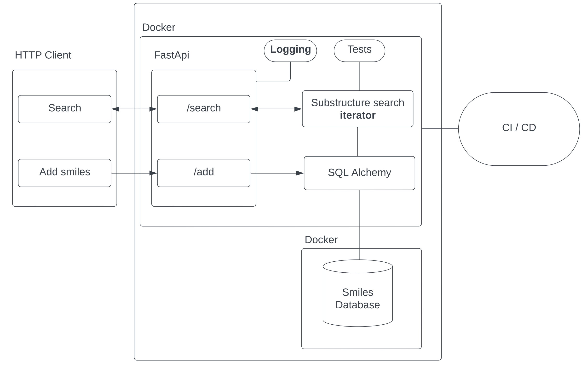

- We will add caching using **Redis** to optimize queries

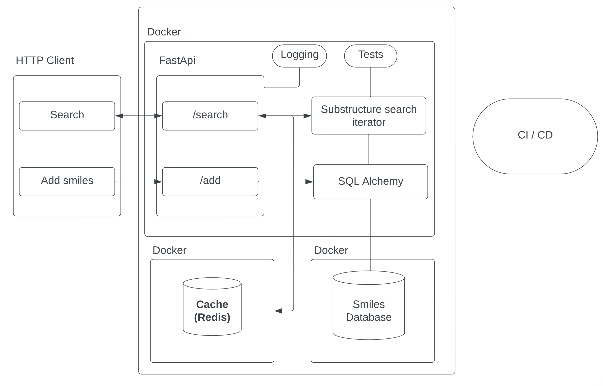

- **Celery** to speed up queries
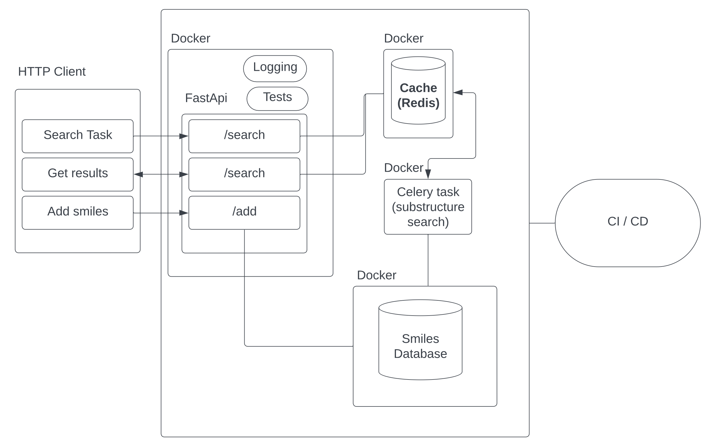

Every week we will add tasks to the folder **hw**. 
Delivery details are available in the **README.md** in the **hw**