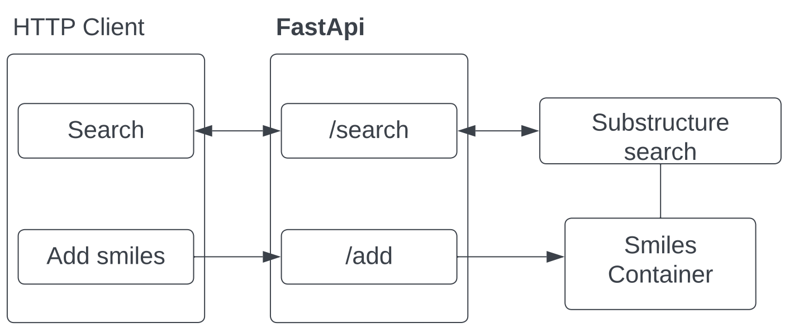

# Homework 5
## Our first server

During our last homework, we implemented the substructure search for molecules.
Now you need to make a server using FastAPI framework to use our algorithm.
Try to use the best practices that were discussed during the lesson.

It is necessary to implement the following API methods:
- Add molecule (smiles) and its identifier
- Get molecule by identifier
- Updating a molecule by identifier
- Delete a molecule by identifier
- List all molecules
- Substructure search for all added molecules
- **[Optional]** Upload file with molecules (the choice of format is yours). 

We are not yet familiar with databases, so we can use standard data structures 
that we covered in previous classes and store them in RAM. Write code in file `/src/main.py`

Don't forget to create a new branch and make a pull request. 
Reviewer is [Maria Galetskaya](https://github.com/galetskaya-quantori)
